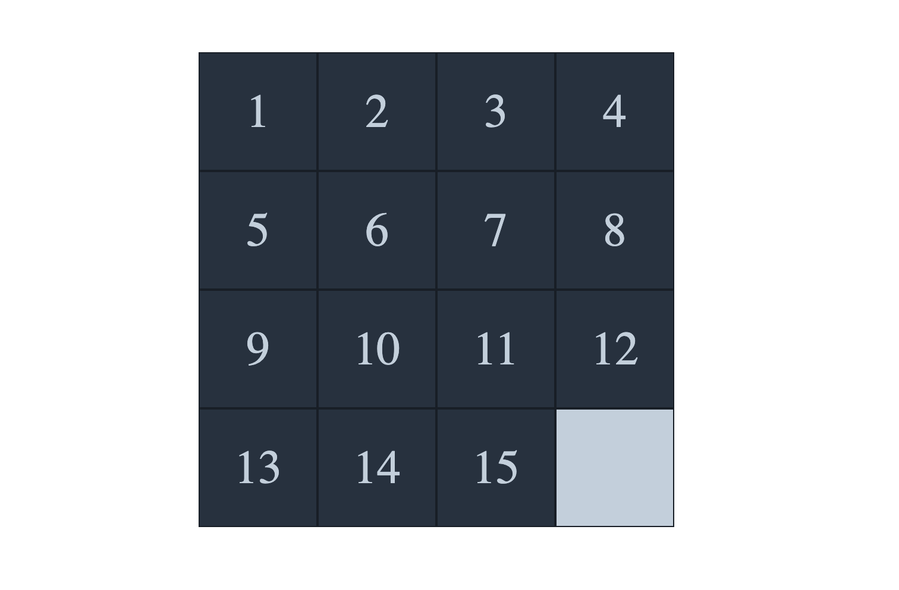

# TP Puzzle / Taquin

Nous allons essayer de créer un Puzzle (numéros ou image) en jQuery. Vous utiliserez Github pour versionner le projet.
Voici un exemple : https://www.artbylogic.com/puzzles/numSlider/numberShuffle.htm

On a une liste de cases avec des numéros dans le désordre et l'objectif est de déplacer les cases pour tout mettre dans le bon ordre.

Voici la liste des fonctionnalités à implémenter :

- On commence par créer l'apparence du jeu (maquette fournie) avec des cases de 100px sur 100px. On va commencer par un 4 par 4. Il faut donc avoir 15 carrés avec une zone vide.

- On doit ensuite pouvoir cliquer sur chaque case du jeu. On doit positionner ce carré sur la place vide.
  Chaque carré doit être positionné (relative ou absolute) par rapport à la zone du jeu.
  On doit récupèrer la position (top, left) du bloc cliqué (prédéfinie en CSS) en jQuery.
  On récupère ensuite la position du bloc vide
  On intervertit ensuite les positions de ces blocs via jQuery.
- Prochaine étape, on devoir vérifier que la case à déplacer est à côté d'une case vide. Il faudra donc comparer le top et le left
  des deux cases. Si on a une différence de moins de ou égale à 100px sur le top ou le left, il y a des chances que la case soit à côté.
- Autre étape, on mélangera les cases aléatoirement à chaque rafraichissement de la page sinon ce n'est pas drôle.
- BONUS: Compter les déplacements en temps réel
- BONUS: Ajouter un chronomètre et détecter la fin de la partie quand toutes les cases sont parfaitement placées. On pourra utiliser un id sur les cases pour savoir
  l'ordre correct.
- BIG BONUS: Adapter le jeu pour que cela fonctionne avec une image (On peut découper une image avec un background image et un background position)
- BONUS: On arrive sur le jeu, on voit l'image complète, on clique sur jouer, elle se mélange, le chrono se déclenche. On pourra également recommencer la partie.
  On ne pourra pas cliquer sur une case tant que la partie n'a pas démarrée.
